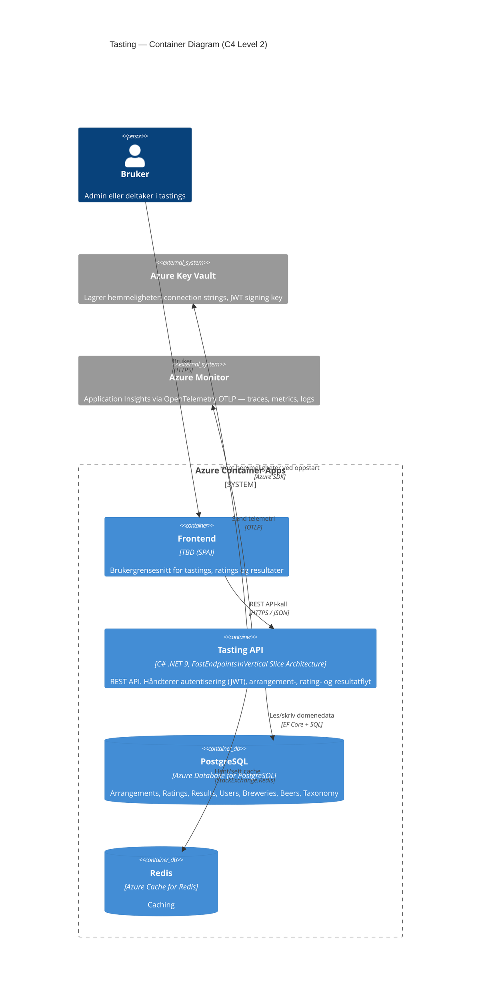

# Architecture — Tasting (C4 Level 2 Container Diagram)

## Komponenter

| Container | Teknologi | Ansvar |
|---|---|---|
| **Frontend** | TBD (SPA) | Brukergrensesnitt |
| **Tasting API** | C# .NET 9, FastEndpoints, Vertical Slice | REST API, JWT auth, domenelogikk |
| **PostgreSQL** | Azure Database for PostgreSQL, EF Core, FluentMigration | All persistent domenedata |
| **Redis** | Azure Cache for Redis | Caching |
| **Azure Key Vault** | Azure SDK | Hemmeligheter (connection strings, signing key) |
| **Azure Monitor** | OpenTelemetry OTLP | Traces, metrics, logger |

## Nøkkelbeslutninger

- **[ADR-0014](adr/0014-fastendpoints-mongodb-and-shared-service-pattern.md)** — FastEndpoints + shared service pattern
- **[ADR-0034](adr/0034-postgresql-replaces-mongodb.md)** — PostgreSQL erstatter MongoDB for all lagring
- **[ADR-0032](adr/0032-api-versioning-from-day-one.md)** — API-versjonering fra dag én (`/api/v1/...`)
- **[ADR-0031](adr/0031-unified-error-contract-across-endpoints.md)** — Felles feilkontrakt på tvers av alle endepunkter
- **[ADR-0001](adr/0001-arrangement-lifecycle-gates.md)** — Arrangement livssyklus-porter

## Lokalt utviklingsmiljø

.NET Aspire (`Tasting.AppHost`) orkestrerer alle containere lokalt med service discovery og Aspire Dashboard for observabilitet.
